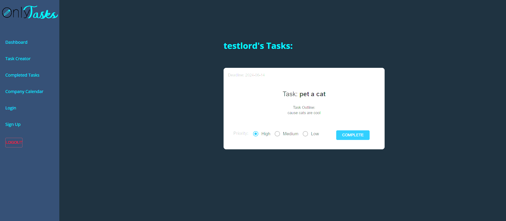

# OnlyTasks

## Description

A task tracking application which can be scaled to work for a whole company

## Table of Contents

- [Installation](#installation)
- [Usage](#usage)
- [License](#license)
- [Contributing](#contributing)
- [Tests](#tests)
- [Questions](#questions)

## Screenshot

## Usage

Keeping tasks assigned directly to employees so they can know what they need to get done and what order to do it in by priority

## License

https://opensource.org/licenses/MIT

This project is licensed under the MIT License.

## Contributing

n/a

## Tests

signing up for an account and creating tasks, marking those tasks as complete and viewing them on the complete page

## Questions

If you have any questions about this project, you can reach me at orion.m.cannon@gmail.com
or you can find me on GitHub at [OrionC11](https://github.com/OrionC11).
